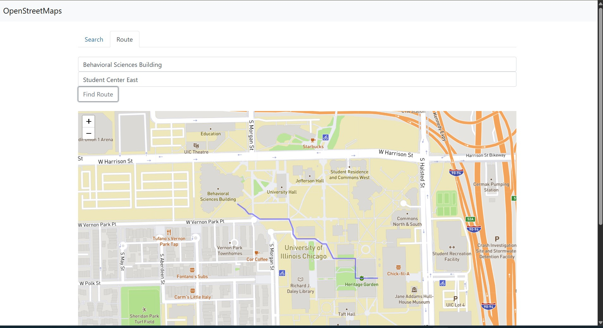

# 📍 UIC Interactive Campus Map & Routing Engine

A Full-Stack navigation application that models the University of Illinois Chicago (UIC) campus layout as an undirected graph and computes optimized walking routes between campus locations.

---

## 📸 Feature Showcase

*Figure 1: Full-stack routing interface demonstrating a computed path between two selected campus buildings.*

---

## 🚀 Key Features

*   **🔍 Search & Pinpoint:** Instantly resolves partial queries or official building abbreviations (e.g., "SEL", "BSB") to drop high-precision location markers on the map interface.
*   **🗺️ Dijkstra Pathfinding:** A highly optimized C++ routing engine that traverses campus waypoints and footways to draw the absolute shortest path between two points.
*   **📍 Proximity Radial Search:** Computes spatial distances on the fly to detect and visually highlight all relevant campus structures within a 200-meter radius of a selected building.
*   **⚡ Predictive Input UI:** Uses an integrated autocomplete engine to provide seamless, fluid destination selection for users.

---

## 🛠️ Tech Stack

*   **Backend:** C++ (Graph Networks, Priority Queues, Custom Dijkstra Engine)
*   **Frontend:** JavaScript (ES6+), jQuery, Leaflet.js, OpenStreetMap API
*   **Data Serialization:** JSON (Parsing university waypoints, footways, and coordinate nodes)

---

## 🧠 Architectural Overview

1. **Graph Construction:** The C++ backend parses raw geographical JSON data, mapping out campus waypoints as vertices and footways as undirected edges with calculated weights.
2. **Pathfinding Request:** The web UI captures starting and ending coordinate IDs via AJAX requests sent to the routing engine.
3. **Route Generation:** The Dijkstra module computes the path list, which is passed back to the frontend as a coordinate array.
4. **Visual Rendering:** Leaflet polyline layers dynamically draw the active route directly onto the map screen.

---

## 🔒 Security Note
*Proprietary map data files and active Mapbox access keys have been scrubbed or omitted from this public repository to protect university network assets and maintain academic integrity guidelines.*

